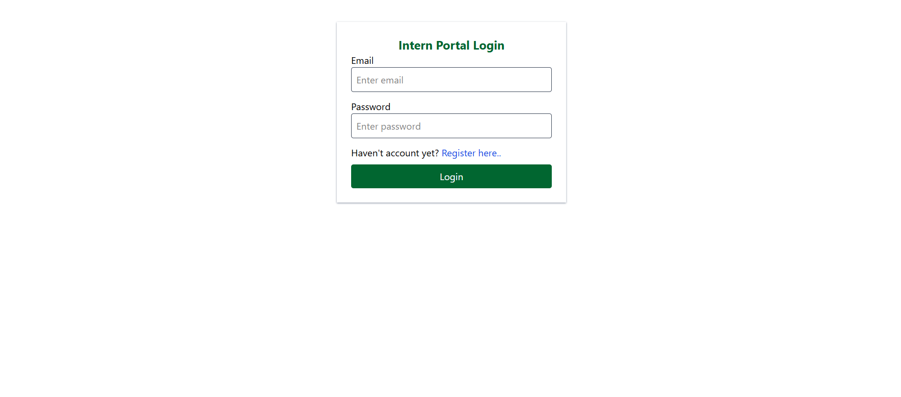
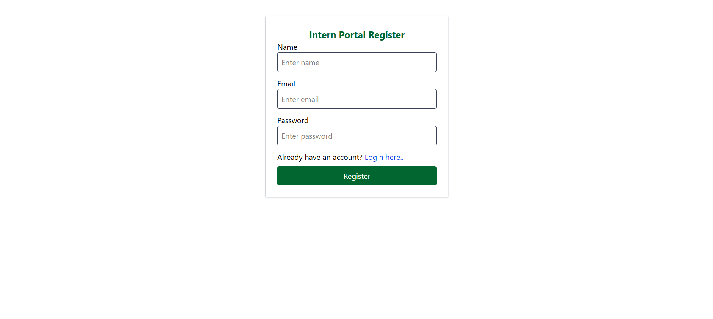
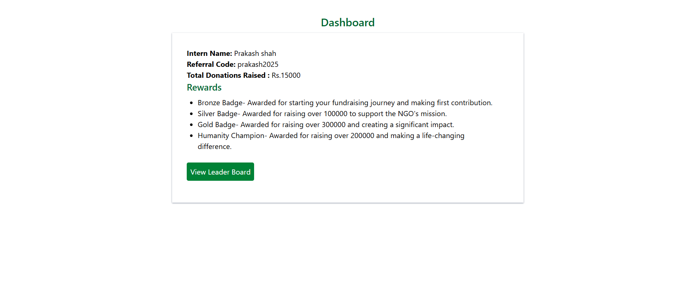
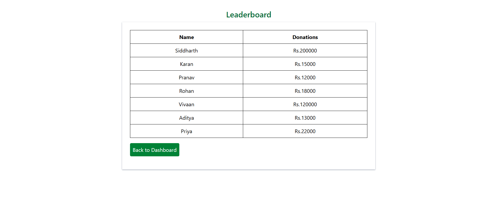

# Intern Portal Dashboard

A simple full-stack demo application for track the intern dummy data, rewards and learderboard.
This project uses a dummy login (no authentication), a dashboard with intern details and a static json data from backend.  

---

## Features  

### Frontend
- Dummy Login /Signup page(no auth)
-**Dashboard**:
 - Intern name
 - Dummy referral code
 - Total donations raised
 - Rewards/Unlockables section
-**Leader board page** - Displays top fundraisers using dummy data.

### Backend
- Simple REST API that returns data

 ---

## 🛠️ Tech Stack
- **Frontend**: React, Tailwind CSS
- **Backend**: Node.js/Express
- **Data Storage**: Static JSON

---

## 🚀 Project Setup

### Clone the repo
```bash
git clone https://github.com/Mansi-prasad/Intern-Portal-Dashboard  
cd Intern-Portal-Dashboard  
```
### Install dependencies
**For Frontend:**  
```bash
cd frontend  
npm install  
```

**For Backend:**  
```bash
cd backend  
npm install
```  

create .env file in frontend root folder:

```bash VITE_BACKEND_URL=http://localhost:5000 ```

Start the Backend
```bash npm run server ```

Start the Frontend
```bash npm run dev ```


## 📸 Screenshots

**Login/Signup page:** 





**Dashboard:**



**Leader Board:**



## Live Link


